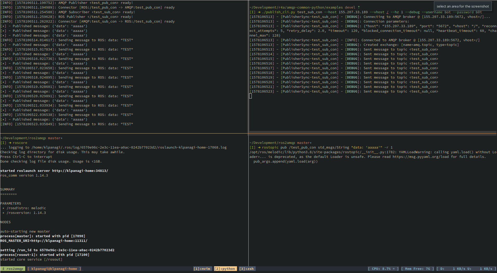

# ros2amqp
ROS/ROS2 to AMQP (Rabbitmq) protocol connectors



## Examples

### Example 1 - Dynamically create and run model instances from input model file

```python
from __future__ import (
    absolute_import,
    division,
    print_function,
    unicode_literals
)

import sys

from ros2amqp import (
    ConnectorThreadExecutor,
    YAMLParser
)


def main():
    model_path = ''
    if len(sys.argv) < 2:
        model_path = 'example_model.yaml'
    else:
        model_path = sys.argv[1]
    c_list = YAMLParser.load(model_path)
    executor = ConnectorThreadExecutor()
    for c in c_list:
        executor.run_connector(c)

    try:
        executor.run_forever()
    except Exception as exc:
        sys.exit(1)


if __name__ == "__main__":
    main()

```

### Example 2 - Dynamically create and run model instances programmatically

The below example creates a Sub and a Pub Connector and runs them in
an Executor.

```python
#!/usr/bin/python2

from ros2amqp import (
    PubConnector, ROSPubEndpoint, BrokerPubEndpoint,
    SubConnector, ROSSubEndpoint, BrokerSubEndpoint,
    RPCConnector, ROSServiceEndpoint, BrokerRPCEndpoint,
    BrokerAuthPlain, BrokerDefinition,
    ConnectorThreadExecutor
)

import sys


def main():
    broker = BrokerDefinition(
        name=None,
        host='155.207.33.189',
        port='5672',
        vhost='/',
        global_ns=''
    )

    ros_ep_1 = ROSPubEndpoint(
        msg_type='std_msgs/String',
        uri='/test_pub_con',
        name='test_pub_con'
    )

    broker_ep_1 = BrokerPubEndpoint(
        uri='test_pub_con',
        name='test_pub_con',
        broker_ref=broker,
        auth=BrokerAuthPlain(username='bot', password='b0t')
    )

    ros_ep_2 = ROSSubEndpoint(
        msg_type='std_msgs/String',
        uri='/test_sub_con',
        name='test_sub_con'
    )

    broker_ep_2 = BrokerSubEndpoint(
        uri='test_sub_con',
        name='test_sub_con',
        broker_ref=broker,
        auth=BrokerAuthPlain(username='bot', password='b0t')
    )

    ros_ep_3 = ROSServiceEndpoint(
        srv_type='std_srvs/Empty',
        uri='/test_srv_con',
        name='test_srv_con'
    )

    broker_ep_3 = BrokerRPCEndpoint(
        uri='test_srv_con',
        name='test_srv_con',
        broker_ref=broker,
        auth=BrokerAuthPlain(username='bot', password='b0t')
    )

    pc = PubConnector(ros_ep_1, broker_ep_1)
    sc = SubConnector(ros_ep_2, broker_ep_2)
    rpc_con = RPCConnector(ros_ep_3, broker_ep_3)

    executor = ConnectorThreadExecutor()
    executor.run_connector(pc)
    executor.run_connector(sc)
    executor.run_connector(rpc_con)

    executor.run_forever()


if __name__ == "__main__":
    main()
```

The example can also be found [here](https://github.com/klpanagi/ros2amqp/blob/master/examples/executor.py).


### Example 3 - Generate bridge from input model file

```python
from __future__ import (
    absolute_import,
    division,
    print_function,
    unicode_literals
)

import sys

from ros2amqp import (
    BridgeGenerator
)


def main():
    model_path = ''
    if len(sys.argv) < 2:
        model_path = 'example_model.yaml'
    else:
        model_path = sys.argv[1]
    bgen = BridgeGenerator()
    bgen.gen_from_yaml(model_path)


if __name__ == "__main__":
    main()
```
